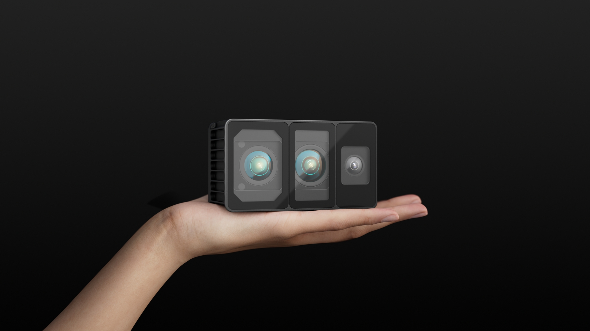
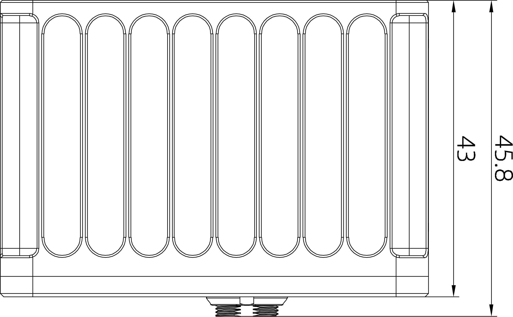

# 1. 产品概述

## 1.1  产品简介
 
### MindPalace Odin1:全球首款空间记忆模组
深度融合LiDAR与视觉传感器，实现高精度、广视角的实时三维感知，内置MindSLAMTM高性能融合SLAM算法，实现持久空间记忆，打造大脑“海马体”级导航与认知。适合机器人、自主导航平台与智能边缘设备的快速集成与部署，可在室内外复杂环境中稳定运行。

## 1.2 外观尺寸
### 产品外观

### 产品尺寸

 

