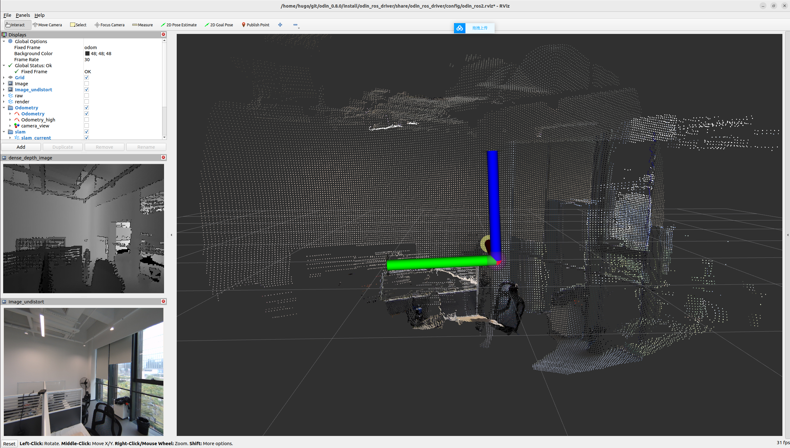

# 6. Odin1 快速启动

## 6.1 硬件设备安装
硬件组成：Odin主机、数据线、电源线（电源适配器需用户自行准备）


## 6.2 设备连接PC
```shell
lsusb
# 2207：0019即为Odin USB设备号
Bus 002 Device 014: ID 2207:0019 Fuzhou Rockchip Electronics Company hawk
```

## 6.3 获取驱动

```shell
git clone https://github.com/manifoldsdk/odin_ros_driver.git
```
## 6.4 创建 udev rules
```shell
sudo gedit /etc/udev/rules.d/99-odin-usb.rules
# 将下述内容粘贴到99-odin-usb.rules文件中，保存
SUBSYSTEM=="usb", ATTR{idVendor}=="2207", ATTR{idProduct}=="0019", MODE="0666", GROUP="plugdev"
# 重新加载并导入设备
sudo udevadm control --reload
sudo udevadm trigger
```
## 6.5 运行驱动
> **📌 运行驱动之前请确保设备已正常通电并接入电脑**
```shell
mkdir -p catkin_ws/src
# 手动将odin_ros_driver放到src文件夹中,$PATH为用户自己使用路径
cp -r $PATH/odin_ros_driver $PATH/catkin_ws/src
# 驱动提供了编译脚本，路径为：catkin_ws/src/odin_ros_driver/script/
./build_ros2.sh      # ros1则运行build_ros.sh
cd $PATH/catkin_ws
source install/setup.bash
ros2 launch odin_ros_driver odin1_ros2.launch.py
```


## 6.6 快速启动手册获取
- [Odin1快速启动手册](assets/pdf/Odin1快速启动.pdf)