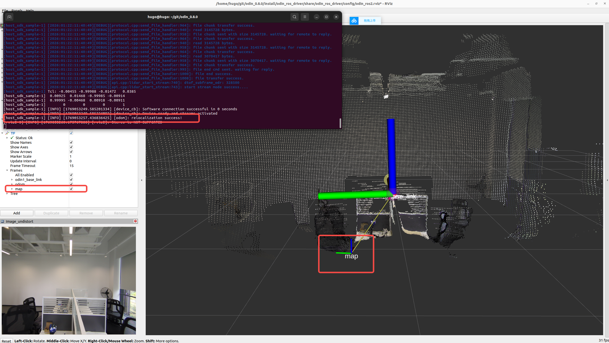

# 7. Odin1 重定位功能
## 7.1 说明
> Odin1目前支持三种使用模式：ODOM里程计模式、SLAM模式和Relocalization重定位模式。模式切换均通过修改/catkin_ws/src/odin_ros_driver/config/control_command.yaml文件中“custom_map_mode”参数进行配置

## 7.2 使用教程

- **step1: 设置“custom_map_mode=1”启用SLAM模式，开始录制地图，该模式下在录制结束时会进行回环检测。**
  
- **step2: 当地图采集完成后请勿直接“Ctrl+c”退出驱动，需要另起终端进入/catkin_ws/src/odin_ros_driver路径下运行“./set_param.sh save_map 1”等待驱动运行终端提示地图保存完成后方可停止。此时会在用户指定目录下生成地图bin格式文件，如果用户未设置，则默认会以结束时间戳命名保存在map文件夹中。**
  
- **step3: 在control_command.yaml文件中修改“custom_map_mode=2”并设置地图保存路径（精确到文件后缀）。**
  
- **step4: 重新运行驱动，重定位成功可以看到终端提示，且/tf中出现map坐标系。**

