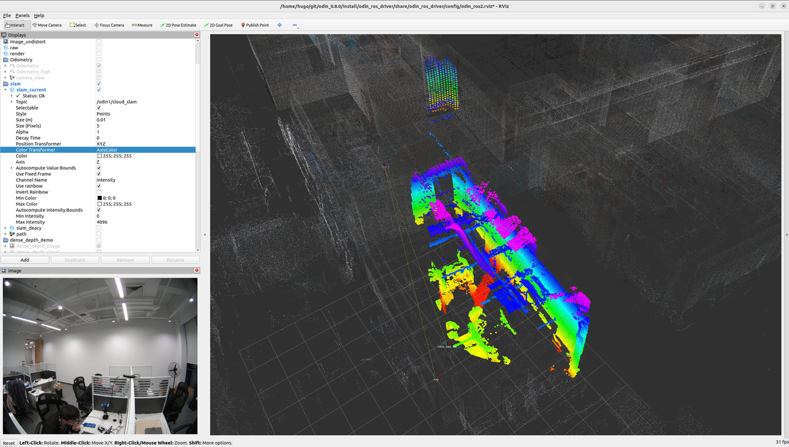

# 11. Odin1 重定位地图获取手册

📄 [Download English PDF: Odin1 Relocalization Map Acquisition Guide](./assets/pdf/Odin1-Relocalization-Map-Acquisition-Guide.pdf)

📄 [下载中文PDF：Odin1 重定位地图获取手册](./assets/pdf/Odin1重定位地图获取手册.pdf)

## 11.1 说明
> Odin1提供重定位功能，已实现与MANIFOLD手持扫描仪的数据联动。目前我们提供3个方案：
- 1.使用Odin采集olx数据，通过Mindcloud处理后使用“导出地图”功能导出bin文件用于Odin的重定位；
- 2.使用留形手持扫描仪（留形机，如：Q9000）采集lx数据，通过Mindcloud处理后使用“导出地图”功能导出bin文件用于Odin的重定位；
- 3.使用Odin SLAM模式生成bin文件用于Odin的重定位。

## 11.2 使用教程

### 11.2.1 方案1：使用Odin采集olx数据，导出地图

Odin录制olx文件（Odin固件版本要求0.10.0以上，驱动版本0.9.0以上）
- 使用ubuntu系统，驱动设置recorddata: 1
- 使用windows系统，运行OdinViewer，录制数据
- 使用Mindcloud处理olx文件，在后处理中点击“导出地图”按钮，获取重定位bin文件

### 11.2.2 方案2：使用留形手持扫描仪采集lx数据（如您手上无留形手持扫描仪，请选择其他方案），导出地图

留形手持扫描仪录制lx文件
- Q9000连接手机，使用Mindcloud Go进行数据扫描
- 扫描结束后将工程文件导出到本地
- 使用Mindcloud处理lx文件，在后处理中点击“导出地图”按钮，获取重定位bin文件

### 11.2.3 方案3：使用Odin SLAM模式生成bin文件

Odin录制slam数据
- 使用ubuntu系统，驱动设置recorddata: 0，同时将map mode设置为1
- 录制解释后请勿C掉驱动进程，另起终端进入/catkin_ws/src/odin_ros_driver路径下运行“./set_param.sh save_map 1”等待驱动运行终端提示地图保存完成并在对应文件夹中生成bin文件后方可停止
- 设置map mode: 2进入重定位模式
- 重新运行驱动开始重定位

## 11.3 重定位地图显示
olx文件导入Mindcloud后，除了可以导出重定位的地图，也可以直接点击左上角的保存，保存pcd格式的点云地图。此地图可用于rviz的显示，需要对其进行发布，可以对pcd进行抽稀后自定义发布节点发布到ros中，可参阅如下python代码：

- [pcd_publisher.py](assets/code/pcd_publisher.py)

最终结果显示如下：
