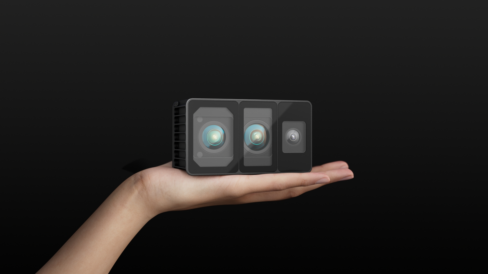

# 1. 产品概述

## 1.1  产品简介
 
### MindPalace Odin1:全球首款空间记忆模组
深度融合LiDAR与视觉传感器，实现高精度、广视角的实时三维感知，内置MindSLAMTM高性能融合SLAM算法，实现持久空间记忆，打造大脑“海马体”级导航与认知。适合机器人、自主导航平台与智能边缘设备的快速集成与部署，可在室内外复杂环境中稳定运行。

# 2. 技术参数

| 分类 | 参数名称 | 规格/数值 |
|:-:|:-:|:-:|
| **深度模组** | 深度分辨率 | 240 * 180 |
|| 测距范围(Max)| 30m@10%反射率(<500lux) 70m@90%反射率(<500lux) |
|| 测距范围(Min)| 0.2m |
|| 点频 | 最高700,000 pts/s |
|| 测距精度| ±3cm@1&sigma;[1] |
|| 视场角(FOV,水平X 垂直)| 120° H X 90° V |
|| 角分辨率| 0.5° x 0.5° |
|| 激光波长| 940 nm |
|| 激光安全等级| Class 1人眼安全 |
|| 帧率| 默认10FPS,最高15FPS |
| **RGB相机模组** | 分辨率 | 1600 X 1296 |
|| 曝光方式| 全局曝光(Global Shutter) |
|| FOV(HXV)| 129°H x 104°V x 173°D |
| **整机参数**| 内置SLAM定位精度| ±5cm+1%[2] |
|| 重量| 约280g |
|| 体积(LXWXD)| 约100x62x43(主体)/46(含航空插头) 单位:mm |
|| 功耗| 额定11W,峰值24W |
|| 防护等级| IP67 |
|| 工作电压| 12-24 V |
|| 工作温度| -20℃ ~ 55℃|
|| 存储温度| -25℃ ~ 60℃|
| **数据输出**| 点云 | 真彩SLAM/原始点云 |
|| 照片| 原始RGB图像 |
|| IMU| 高频原始数据 |
|| 位姿| 高频旋转、位置数据 |
|| 软件接口| 提供开源SDK，支持ROS1/ROS2数据通信 |

**【1】** 室内测试环境，在80% Lambertian反射板上连续20帧的数据计算Std精度值。5m条件下，+/-3cm@1sigma, 5-30米1sigma精度值<1%
**【2】** 实验室条件下
