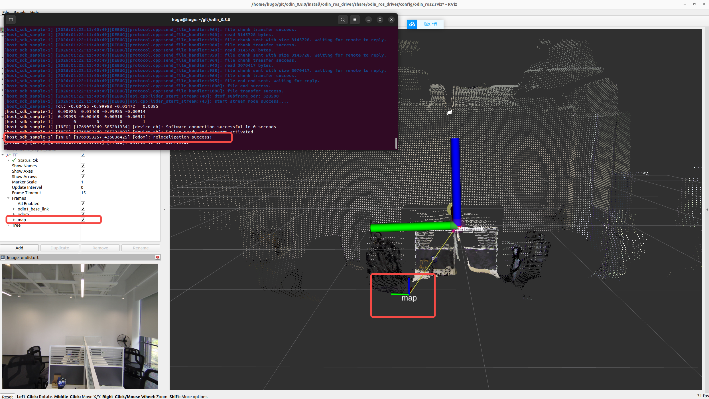
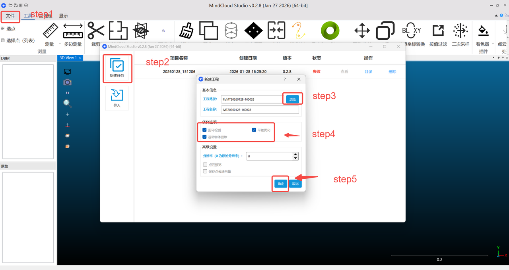
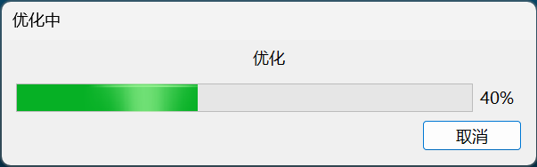
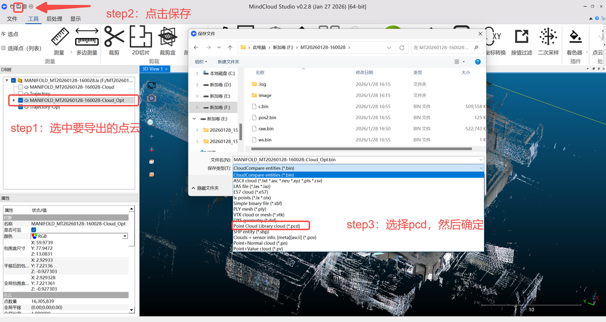
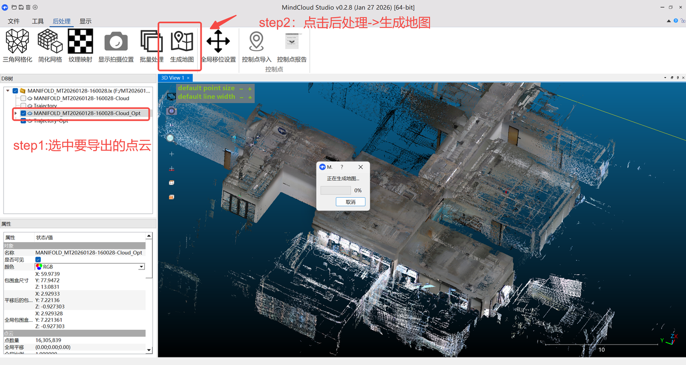
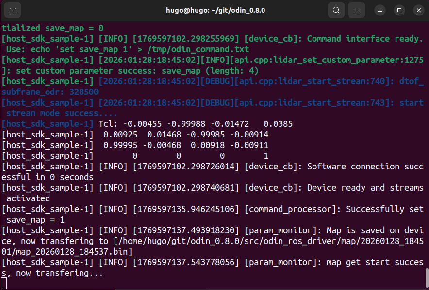
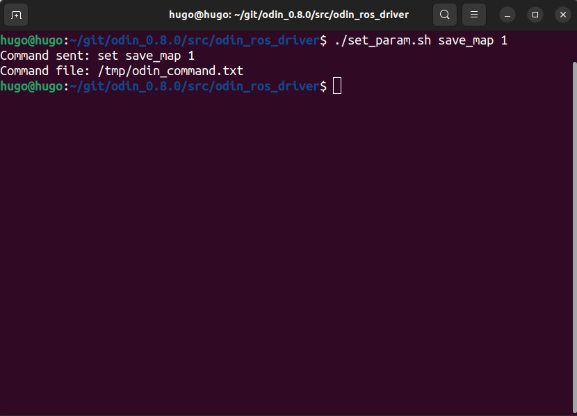
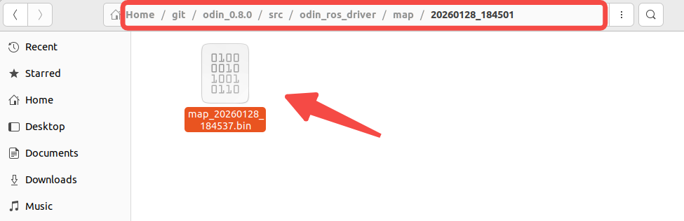
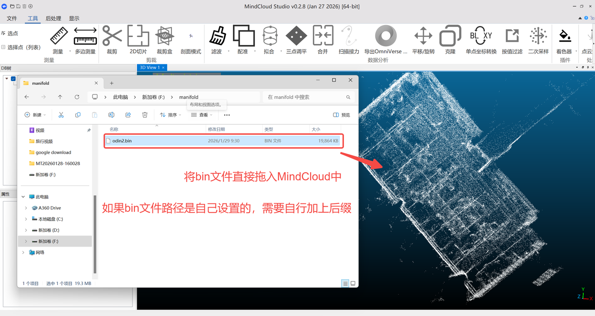

# 9. Odin1重定位功能

## 9.1 说明
> Odin1目前支持三种使用模式：
> - ODOM里程计模式：设置"custom_map_mode = 0"打开odometry模式，该模式下，map的frame和odom的frame使用同一个pose轨迹。
> - SLAM模式：设置"custom_map_mode = 1"打开slam模式，该模式在里程计模式的基础上增加了回环检测和地图保存功能，提供完整的 SLAM 系统。启动驱动程序后，odin1 将自动执行建图并缓存地图数据。场景采集完成后，用户需要在驱动程序的源代码目录下执行 ./set_param.sh save_map 1 命令，以保存自程序启动以来收集的所有地图数据。地图将保存到config/control_command.yaml 文件中由 mapping_result_dest_dir 和 mapping_result_file_name 参数指定的位置。如果未指定这些参数，将使用默认值。首次保存后，您可以再次执行该命令以保存新地图。每次保存操作都会生成一个新的地图文件。（连续保存操作之间请至少间隔 5 秒）地图原点对应程序启动时的里程计坐标系原点。
> - Relocalization重定位模式。要启用重定位功能，请设置 custom_map_mode = 2，并在 config/control_command.yaml 文件中使用 relocalization_map_abs_path 参数指定预构建地图的绝对路径。启动后，odin1 将根据当前视角和指定的地图启动重定位过程。为确保较高的成功率，建议在 SLAM 轨迹的原始位置和方向 ±1 米/±10 度的范围内启动。请注意，重定位性能高度依赖于环境。在特征高度明显的场景中，即使超出 1 米/10 度的范围也可能成功匹配，而其他环境可能需要更严格的条件。我们建议在目标环境中进行测试，以确定实际的容许范围。如果初始重定位失败，系统将临时运行在备用的 SLAM 模式（此状态下地图保存功能禁用）。在此期间，您可以自由移动 odin1。它将在后台继续尝试重定位。一旦成功，将发布地图坐标系与里程计坐标系之间的 TF 变换。（提示：初始化后轻轻晃动或移动设备有助于提高重定位精度。）以下主题在里程计坐标系中发布：/odin1/cloud_slam、/odin1/odom、/odin1/highodom 和 /odin1/path。要在地图坐标系中获取这些数据，请应用从里程计坐标系到地图坐标系的 TF 变换。

## 9.2 使用教程

- **step1: 设置“custom_map_mode=1”启用SLAM模式，开始录制.bin地图，该模式下在录制结束时会进行回环检测。**
  
- **step2: 当地图采集完成后请勿直接“Ctrl+c”退出驱动，需要另起终端进入/catkin_ws/src/odin_ros_driver路径下运行“./set_param.sh save_map 1”等待驱动运行终端提示地图保存完成后方可停止。此时会在用户指定目录下生成地图.bin格式文件，如果用户未设置，则默认会以结束时间戳命名保存在map文件夹中。注：保存地图建议usb速率<code>lsusb -v -d 2207:0019 | grep -i bcdusb</code>看到的结果为3.2。**
  
- **step3: 在control_command.yaml文件中修改“custom_map_mode = 2”并设置地图保存路径（精确到文件后缀）。如：/home/hugo/git/odin_0.8.0/map/office.bin**
  
- **step4: 重新运行驱动，重定位成功可以看到终端提示“[INFO] [1769564323.183375282] [odom]: relocalization success!”，且/tf中出现/map坐标系。**




## 9.3 重定位地图可视化

Odin1提供重定位功能，已实现与MANIFOLD手持扫描仪的数据联动。目前我们提供3个方案：1.使用Odin采集olx数据，通过Mindcloud处理后导出bin文件用于Odin的重定位；2.使用留形手持扫描仪（如：Q9000）采集lx数据，通过Mindcloud处理后导出bin文件用于Odin的重定位；3.使用Odin SLAM模式生成bin文件用于Odin的重定位。详细操作如下。

### 9.3.1 方案一：使用Odin采集地图

#### 1. Odin录制olx文件（需要在ubuntu系统，Odin固件版本要求0.10.0，驱动版本0.9.0）
- 修改/catkin_ws/src/odin_ros_driver/config/control_command.yaml文件中参数，打开recorddata: 1 选择custom_map_mode: 0 (odom模式)：
```shell
recorddata: 1           # 0: off; 1: on
***
custom_map_mode: 0      # 0: Odometry mode 1: SLAM mode 2: Relocalization mode
```
- 运行驱动开始采集地图
```shell
cd ~/catkin_ws
# 以下以ros2为例，ros1请输入对应的指令
source install/setup.bash
ros2 launch odin_ros_driver odin1_ros2.launch.py
```
- 结束录制：采集完成后Ctrl+c结束驱动，即可在/catkin_ws/src/odin_ros_driver/recorddata中找到对应的包含.olx文件的文件夹。将整个文件夹拷贝到装有MindCloud（版本≥0.2.8，推荐版本0.2.10）的电脑上进行处理。导出.bin文件和.pcd文件

### 9.3.2 方案二：使用手持扫描仪（如Q9000）采集地图

#### 1. Q9000采集录制.lx文件（若手上无此设备请忽略）
- Q9000采集数据
- 将采集的工程文件导入到PC上
- 使用MindCloud处理Q9000数据，导出.bin文件和.pcd文件

💡 Note:
- .bin文件可用于Odin的重定位
- .pcd文件可用于在rviz中显示或客户其他使用

### 9.3.3 MindCloud操作流程

- 导入.olx/.lx文件到MindCloud



- 等待处理完成



- 保存.pcd点云数据



- 保存.bin地图数据



### 9.3.4 方案三：使用Odin slam模式导出.bin地图文件

#### 1. 录制.bin地图文件
- 设置control_command.yaml文件中customer_map_mode: 1，recorddata: 0
```shell
recorddata: 0           # 0: off; 1: on
***
custom_map_mode: 1      # 0: Odometry mode 1: SLAM mode 2: Relocalization mode
```

- 运行驱动进行并数据采集
```shell
cd ~/catkin_ws
# 以下以ros2为例，ros1请输入对应的指令
source install/setup.bash
ros2 launch odin_ros_driver odin1_ros2.launch.py
```

- 采集地图结束后请勿直接Ctrl+c关闭驱动，需要新建终端，进入到驱动路径中，运行./set_param.sh save_map 1保存地图。
```shell
cd ~/catkin_ws/src/odin_ros_driver
./set_param.sh save_map 1
# 等待驱动终端提示保存完成后再结束驱动
```

|终端视图|save_map|保存结果|
| :---: | :---: | :---: |
||| |

### 9.3.5 直接从Odin slam模式获取的.bin文件转.pcd文件

借助MindCloud软件将.bin文件转成.pcd文件



### *9.3.6 rviz显示pcd底图
- 将方案1、2、3获取到的pcd点云地图进行抽稀，建议控制在10~20M的大小（用户需自行写代码实现）；
- 用户自行书写ros发布节点，将抽稀后的pcd文件在ros中发布；
- 成功后可看到结果如下：


